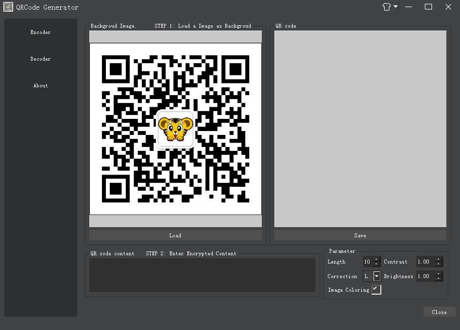
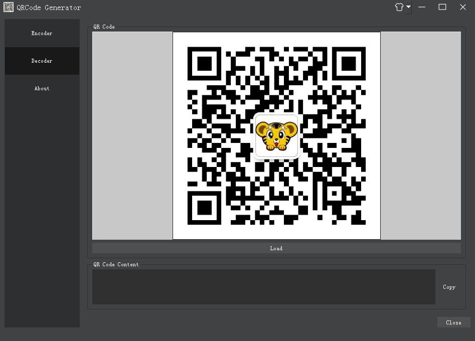
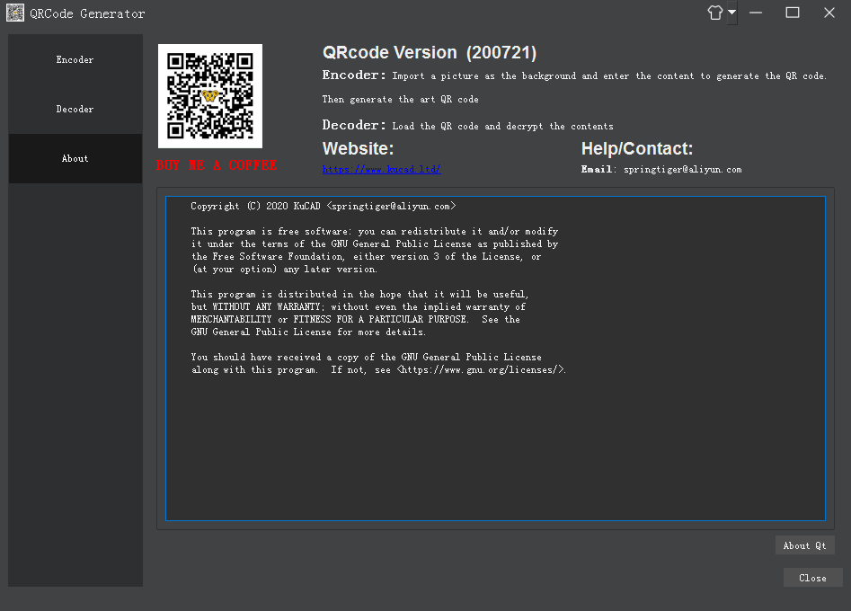

# QRcode
Generate common qr-code, artistic qr-code (black & white or colorized), animated qr-code (black & white or colorized).
。QR码(日本的一家公司研制的矩阵式二维码符号)也是当前使用最广泛的二维码之一，微信支付宝的扫码都是QR码。  

## 功能概述:

  1 借助以下开源项目生成二维码，艺术二维码（黑白或彩色）、动画二维码（黑白或彩色）。
https://github.com/sylnsfar/qrcode
 		工程编译完成后记得将qr.exe拷贝到可执行文件目录下
 		
  2.借助qzxing解码二维码
  
### 运行截图：
  
  
  

```
## 附:Qt程序在windows系统上的打包发布
一个程序完成后，使用Qt生成release版本的可执行exe文件，但是仅有exe可执行文件是无法在别人的机器上运行的。因为QT默认是动态编译的，程序还需要各种各样的动态库文件。  
高版本的qt有一个windows下的部署工具windeployqt.exe，可以用来打包Qt程序。首先将生成的release版本的\*.exe(\*表示你的程序名)文件单独放到一个文件夹中，打开qt的命令行工具，或者将部署工具所在目录添加到系统path变量中，使用cmd命令行进入\*.exe所在文件夹，执行命令windeployqt \*.exe；部署工具会自动将依赖的动态库以及插件放到文件夹下。  
另外不使用部署工具的话也可以直接点击\*.exe根据缺少的库自己添加，就能在本机运行了，但往往还是添不全，在别的机器上仍无法运行。因为还需要plugins下面的一些插件（一般是imageformats文件夹下的各种格式的图片库，和platform下的qwindows.dll），总之缺什么去qt库的bin目录和plugins下找就行。  
## 作者联系方式:
**邮箱:springtiger@aliyun.com**  
**www.kucad.ltd**  
